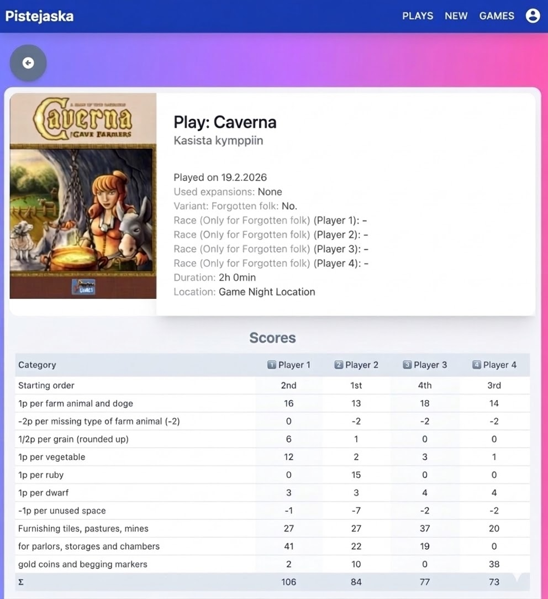

# Pistejaska

With this web app you can easily track board game scores. Key features:
- track scores with customizable and extensible board game templates
- social features: add photos and comments
- report features: see average play duration per game, statistical analysis for best game characters etc.
- optimized for mobile phones, easy & fast to input scores

**Note:** Using the app requires a Google login with a whitelisted email. Ask the project administrator (panu.vuorinen@gmail.com) for permissions.

## Quick Start

### Requirements
- Node.js (20 or newer)

### Installation & Running
1. `git clone https://github.com/panupetteri/pistejaska`
2. `npm install`
3. `npm start`

### Testing
- Run all tests: `npm test`
- Run tests in watch mode: `npm run test:watch`
- Generate code coverage report: `npm run test:coverage`

## Technologies and why we use them
- **React**: Front-end library for productivity due to good composability and large ecosystem.
- **Tailwind CSS**: Utility library for productivity and easy visuals (designed by developers, not designers).
- **TypeScript**: For productivity due to great tooling and static typing.
- **lodash**: Base library, as JavaScript's native utilities can be lacking.
- **Firebase Authentication & Firestore**: Backend for productivity, real-time database, and free hosting.
- **Netlify**: Hosting platform due to free tier and easy-to-setup continuous delivery.
- **Vite & vitest**: For building and testing. They are extremely fast and provide watch modes, greatly improving developer productivity.

## Development Guidelines

Please use ESLint and Prettier for code formatting & linting. The easiest way to achieve this is:
1. Use VS Code.
2. Install the ESLint and Prettier extensions.
3. Configure `"editor.formatOnSave": true` in your settings.
4. Set "Prettier" as the default formatter.

*Alternatively, run `npx prettier src/* --write` before committing.*

**Tips:**
- Analyze bundle size: `npm run build && npm run analyze`
- Install the Tailwind CSS Intellisense extension for VS Code.

## Operations

### Hosting & Building
To build for production: `npm run build`
The `master` branch is automatically built & hosted in Netlify: https://www.pistejaska.net 

### Backups

1. Install gcloud (https://cloud.google.com/sdk/docs/install)
1. `gcloud auth login`
1. `gcloud config set project pistejaska-dev`

#### Backup export

1. `gsutil -m cp -R gs://pistejaska-dev.appspot.com . # copy photos`
1. `gcloud firestore export gs://pistejaska-dev-firestore-backups # export firestore`
1. `gsutil -m cp -R gs://pistejaska-dev-firestore-backups . # copy firestore backup`
1. Copy Firestore rules manually from https://console.firebase.google.com/u/0/project/pistejaska-dev/firestore/rules

#### Backup import

1. Get backup name from https://console.cloud.google.com/storage/browser/pistejaska-dev-firestore-backups?project=pistejaska-dev
1. `gcloud beta firestore import --database="backup" gs://pistejaska-dev-firestore-backups/{name}`
### Migrations

If you need to perform data migrations, do this:

1. Take a backup of the current database :)
1. Acquire Google Cloud Service Account credentials JSON from one of the project admins.
1. Set the GOOGLE_APPLICATION_CREDENTIALS environment variable to point to the credentials JSON
   (see https://cloud.google.com/firestore/docs/quickstart-servers#set_up_authentication for details).
1. Write a migration script under migrations/, prefix the script name with the next free version number.
   See existing scripts for examples.
1. Test migration: `node V0x_MyGreatMigration.js`
1. Run migration: `node V0x_MyGreatMigration.js --prod`

## Contributing
1. Ensure all tests pass (`npm test`).
2. Ensure code coverage is maintained (`npm run test:coverage`).
3. Manually test that Pistejaska still works.
4. Update the changelog.
5. Submit a PR to: https://github.com/panupetteri/pistejaska

## TODO

- Allow users to change their display name in comments and in plays
- Denormalize players from plays to their own root entity & link player to user
- change "misc score field" for unknown expansion scores to be the last field of the PlayForm
- statistical analysis for strongest victory predictor (eg. start order (is starting player more likely to win), number of dwarfs in caverna, player, race used)
- generic reports: games by plays, longest/shortest games, best ELO rating for all games etc
- read support for everyone, write support for whitelisted emails. anonymous users only see anonymized player names.
- normalize player names (firstname and first letter of surname)
- celebration page on save to see the winner with konfetti animation

### Technical debt

- normalize players to their own root entity in Firestore
- better backups
- automatic tests, e.g. playwright

## Known issues

- PWA does not work
